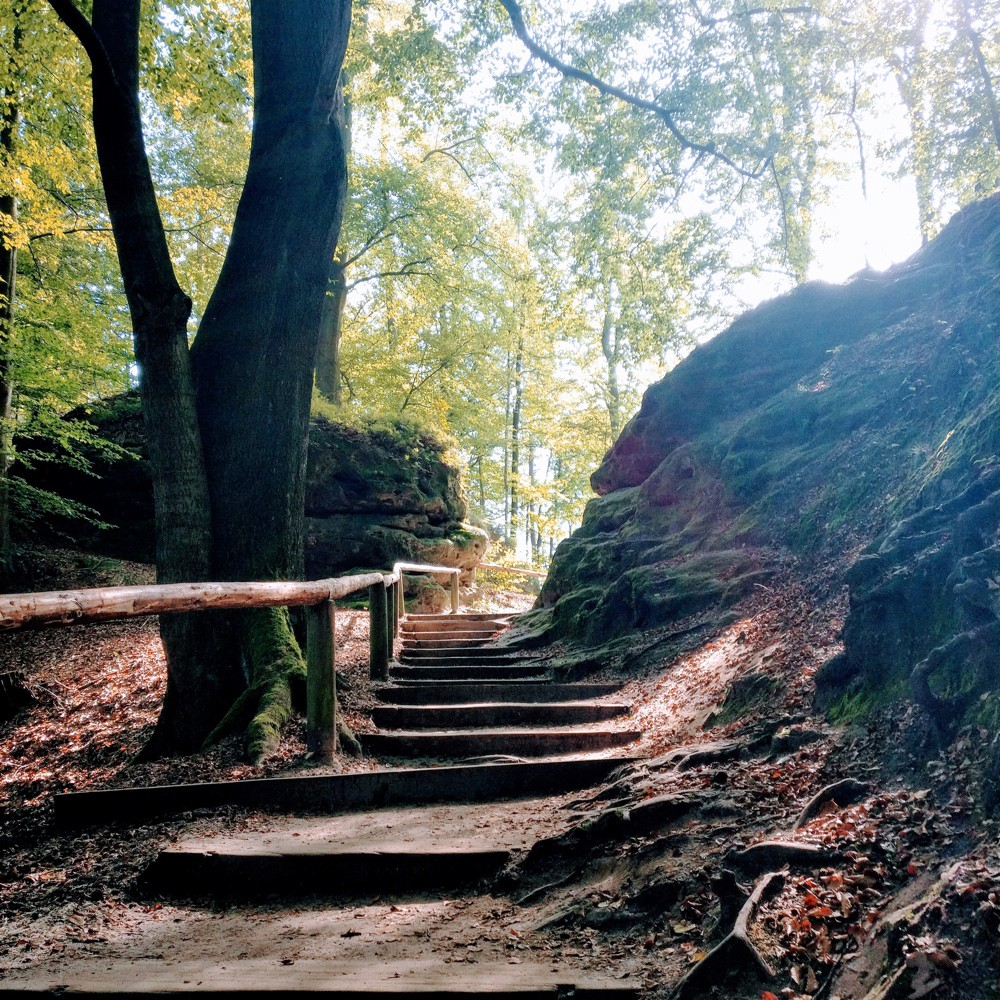

# From 100 % Freelancing to 100 % Freetime  —  My open journey in April

Today is the day I start my open journey through April. *What is that?* I want to challenge myself to be open about what I do with my precious time here on earth and publish at least one thing each workday that may be of value for you.

## How did I get here

As a freelance developer, the last years I spent my time working full-time in customer projects. One gig followed the other. Sometimes there were parallel jobs. I decided to not do jobs in parallel anymore, that it is best for me to focus on one thing, both to remain healthy and to produce the best results I can for my clients. To focus on one thing is a key lesson I learned from the book "[The ONE Thing](https://www.goodreads.com/book/show/16256798-the-one-thing)" which is just one of [many books I'd recommend to you](https://www.goodreads.com/review/list/68184856-jonas?shelf=read).

My last freelance gig was from January to March 2018. I started with a cold and lost my voice. That was certainly not a good start to a project. We were doing daily stand-ups via webcam, but it worked out somehow. Fortunately, I am working 100 % remote so I have not infected anyone.

Like my colleagues, I get at least one email or call from a recruiter a day. Unfortunately, often times the teams are not working remotely, so I refuse the offer. To work full-time remote (i.e. in my office) is one thing I have decided for myself with conviction in the past. I commuted for 1.5 years, I listened to a lot of non-fiction audiobooks during that time, but after all, the commute was not worth sitting at a client's office with my headphones on to reduce the open-office noise.

In March 2018, I declined all opportunities for client projects beginning in April. I turned down the offers, because this journey is what I am going to do. This is my "One Thing" for this month.

## Why

I want to take some time to produce something for the public on my own after years of solely focussing on customer projects and working in private. I want to find out what people are interested in and how I can provide value to somebody else to give something back from all I have been given by consuming media in the past years. Although I share a lot of great articles and some of my own opinions on different topics [on Twitter](https://twitter.com/JonasHavers), I want to create and publish something valuable  to  someone other than my clients and their customers.

That is why I am starting this series, which will hopefully lead into a habit. I am curious where this journey will lead me and how I can help you by doing something meaningful.

## The first day

After I went to bed late at 0:30am, I woke up at 8:30am. I drank some water, caught my fitness mat and did a workout under the instructions of Mark Lauren at home. I have bought one of his dvd sets in February. Since then I am doing at least three HIIT (High Intensity Interval Training) workouts a week in the morning. Afterwards I took a shower where I decided to start into my free time and begin this journey with this post. I collected some ideas for the next days. As I am writing this, it is 2:30pm here in Germany.

## What's next

I will be sharing the publications and the resources I am using [on my blog](/articles/), [on Medium](https://medium.com/@jonashavers) or [on Twitter](https://twitter.com/JonasHavers). Follow me if you want to be updated. I am also thinking about doing short videos or live coding sessions about various topics in the next months.

What would you be interested in? Let me know about your thoughts on this and leave me a message via any channel you feel comfortable with.

Thanks for reading. Have a great day! ✌
